# HKER Project - Complete Function Flowcharts

> Auto-generated from source code. All flowcharts use Mermaid syntax.

---

## 1. System Architecture Overview

```mermaid
graph TB
    subgraph "Client Side"
        A[Browser]
        subgraph "React Components"
            B1[Pages - SSR/Client]
            B2[Components]
            B3[Hooks]
        end
        subgraph "Client Lib"
            C1[api-client.ts]
            C2[auth.tsx - AuthProvider]
            C3[toast.ts]
            C4[theme.ts]
            C5[tools/*.ts]
        end
    end

    subgraph "Next.js Server"
        subgraph "Edge Layer"
            D1[middleware.ts<br/>Security Headers]
        end
        subgraph "API Routes"
            E1[/api/auth/*]
            E2[/api/me/collections/*]
            E3[/api/marketplace/*]
            E4[/api/family-todo/*]
            E5[/api/monthly-bills/*]
            E6[/api/admin/*]
            E7[/api/invites/*]
            E8[/api/health, /api/featured, /api/links/*]
        end
        subgraph "Middleware Wrappers"
            F1[withAuth]
            F2[withOptionalAuth]
            F3[withAdmin]
        end
        subgraph "Server Services"
            G1[auth-service.ts]
            G2[session-service.ts]
            G3[user-service.ts]
            G4[collection-service.ts]
            G5[link-service.ts]
            G6[member-service.ts]
            G7[invite-service.ts]
            G8[permission-service.ts]
            G9[marketplace-service.ts]
            G10[subscription-service.ts]
            G11[family-todo-space-service.ts]
            G12[family-todo-service.ts]
            G13[family-todo-board-service.ts]
            G14[monthly-bill-service.ts]
        end
        subgraph "Infra"
            H1[db.ts - Drizzle ORM]
            H2[PostgreSQL]
        end
    end

    A --> D1
    D1 --> E1 & E2 & E3 & E4 & E5 & E6 & E7 & E8
    E1 & E2 & E3 & E4 & E5 & E6 & E7 & E8 --> F1 & F2 & F3
    F1 & F2 & F3 --> G1 & G2 & G3 & G4 & G5 & G6 & G7 & G8 & G9 & G10 & G11 & G12 & G13 & G14
    G1 & G2 & G3 & G4 & G5 & G6 & G7 & G8 & G9 & G10 & G11 & G12 & G13 & G14 --> H1
    H1 --> H2
```

---

## 2. Middleware — Request Lifecycle

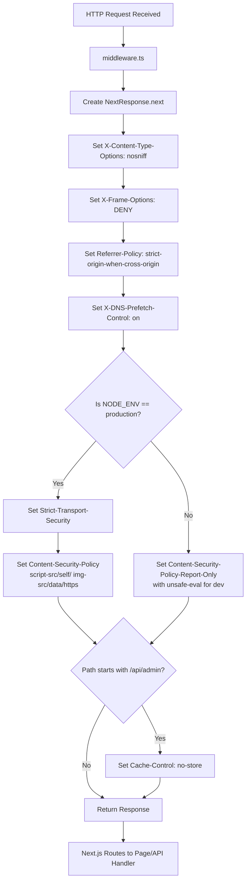

---

## 3. Rate Limiting (DB-Backed Sliding Window)

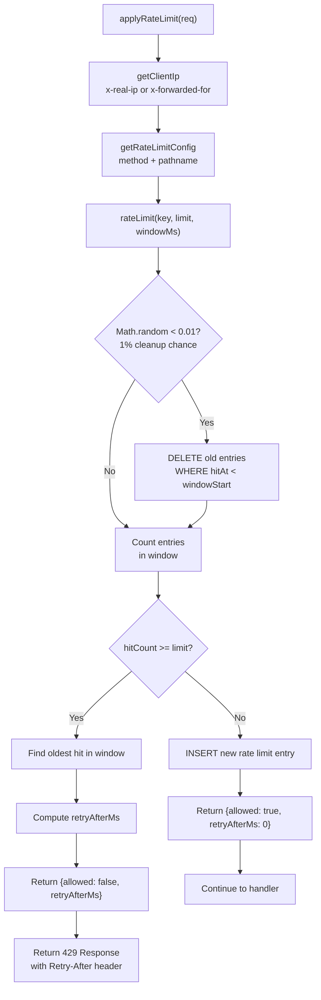

---

## 4. Authentication Flow

### 4.1 Registration

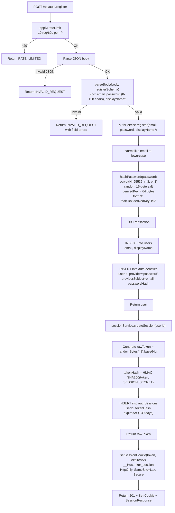

### 4.2 Login

```mermaid
flowchart TD
    A["POST /api/auth/login"] --> B[applyRateLimit<br/>20 req/60s per IP]
    B -->|429| C[Return RATE_LIMITED]
    B -->|OK| D[Parse JSON body]
    D -->|Invalid JSON| E[Return INVALID_REQUEST]
    D -->|OK| F["parseBody(body, loginSchema)<br/>Zod: email, password"]
    F -->|Invalid| G[Return INVALID_REQUEST]
    F -->|Valid| H["isAccountLocked(email)?"]
    H --> I[Query loginFailures by email]
    I --> J{lockedUntil exists<br/>AND not expired?}
    J -->|Yes| K[Return FORBIDDEN<br/>Account locked 15 min]
    J -->|No| L[DELETE old lock record<br/>if expired, unlock]
    L --> M["authService.login(email, password)"]
    M --> N[Normalize email to lowercase]
    N --> O[SELECT authIdentity<br/>WHERE provider='password'<br/>AND providerSubject=email]
    O -->|Not found| P[Throw INVALID_CREDENTIALS]
    O -->|Found| Q["verifyPassword(password, storedHash)"]
    Q --> R[Parse saltHex:hashHex]
    R --> S["scrypt(password, salt, 64)<br/>timingSafeEqual comparison"]
    S -->|Invalid| P
    S -->|Valid| T["userService.findById(userId)"]
    T -->|Not found| P
    T -->|Found| U[UPDATE authIdentities<br/>SET lastUsedAt = now]
    U --> V[Return user]
    V --> W[clearLoginFailures(email)]
    W --> X[createSession + setCookie]
    X --> Y[Return 200 + Set-Cookie + SessionResponse]
    P --> Z["trackLoginFailure(email)"]
    Z --> Z1{First failure?}
    Z1 -->|Yes| Z2[INSERT loginFailures<br/>failCount=1]
    Z1 -->|No| Z3["Increment failCount<br/>If failCount >= 5<br/>set lockedUntil = now + 15min"]
    Z2 --> AA[Return INVALID_CREDENTIALS]
    Z3 --> AA
```

### 4.3 Logout

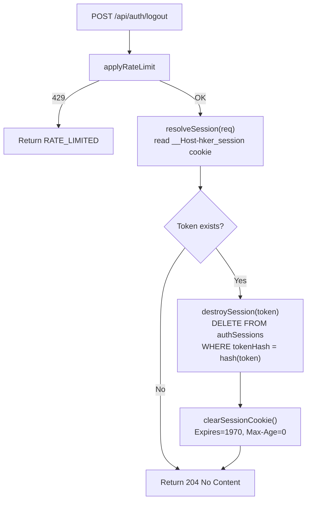

### 4.4 Session Validation

```mermaid
flowchart TD
    A["getServerUser() OR resolveSession(req)"] --> B[Read cookie<br/>__Host-hker_session]
    B -->|No cookie| C[Return null]
    B -->|Has token| D["validateSession(token)"]
    D --> E["tokenHash = HMAC-SHA256(token, SESSION_SECRET)"]
    E --> F[SELECT authSessions<br/>WHERE tokenHash = hash]
    F -->|Not found| G[Return null]
    F -->|Found| H{expiresAt < now?}
    H -->|Yes| I[DELETE expired session]
    I --> G
    H -->|No| J{lastSeenAt throttle<br/>should update? (>5min since last update)}
    J -->|Yes| K[UPDATE lastSeenAt = now]
    J -->|No| L[Skip update]
    K --> M["userService.findById(userId)"]
    L --> M
    M -->|Not found| G
    M -->|Found| N[Return { session, user }]
    N --> O["Map to AuthUser<br/>{id, email, displayName, avatarUrl, role}"]
```

---

## 5. API Middleware Wrappers

### 5.1 withAuth — Full Authentication Required

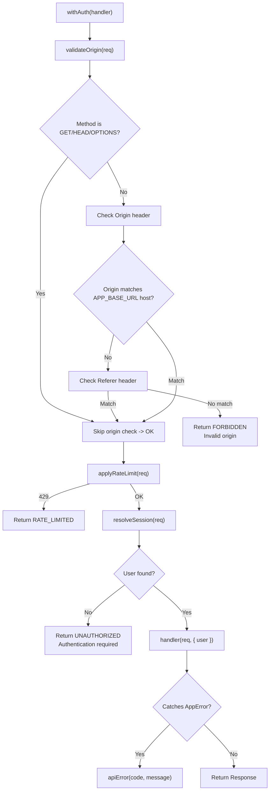

### 5.2 withOptionalAuth — Authentication Optional

```mermaid
flowchart TD
    A["withOptionalAuth(handler)"] --> B["validateOrigin(req)"]
    B -->|Invalid| C[Return FORBIDDEN]
    B -->|Valid| D["applyRateLimit(req)"]
    D -->|429| E[Return RATE_LIMITED]
    D -->|OK| F["resolveSession(req)"]
    F --> G[user = AuthUser | null]
    G --> H["handler(req, { user })"]
    H --> I{Catches AppError?}
    I -->|Yes| J["apiError(code, message)"]
    I -->|No| K[Return Response]
```

### 5.3 withAdmin — Admin Role Required

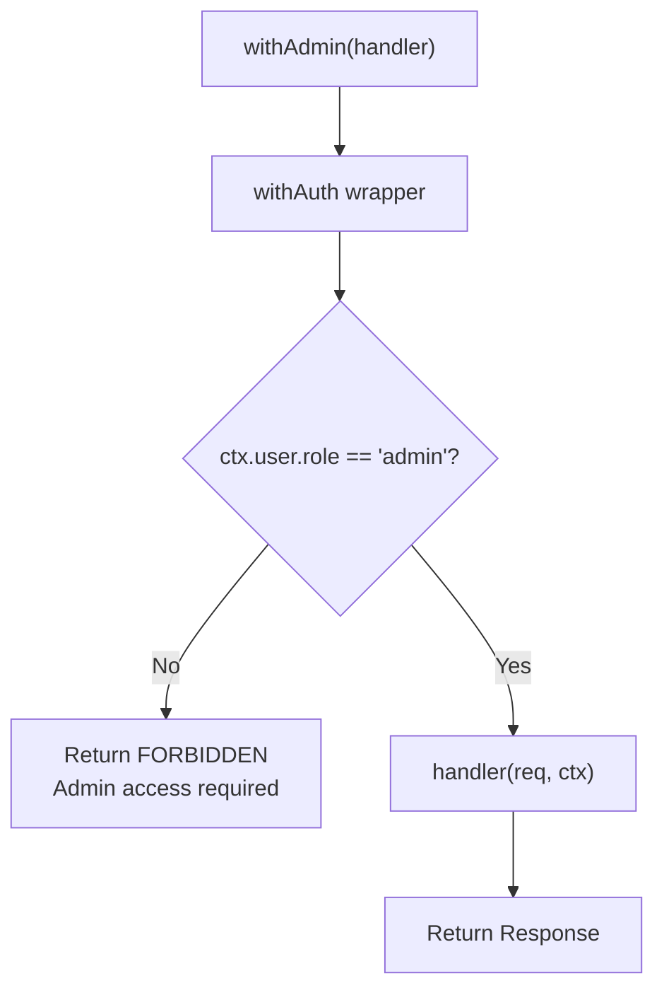

---

## 6. Collection Management

### 6.1 List User Collections

```mermaid
flowchart TD
    A["listForUser(userId)"] --> B[SELECT owned collections<br/>WHERE ownerId = userId<br/>→ memberRole = null]
    A --> C[SELECT member collections<br/>INNER JOIN collectionMembers<br/>WHERE member.userId = userId<br/>→ memberRole = 'editor' | 'viewer']
    B --> D[Merge ownedRows + memberRows]
    C --> D
    D --> E{Any collection IDs?}
    E -->|Yes| F["SELECT link counts<br/>FROM links<br/>WHERE collectionId = ANY(ids)<br/>GROUP BY collectionId"]
    F --> G[Build linkCounts Map]
    E -->|No| H[empty Map]
    G --> I[Map rows to result]
    H --> I
    I --> J["Set access:<br/>ownerId == userId → 'owner'<br/>memberRole == 'editor' → 'editor'<br/>else → 'viewer'"]
    J --> K[Sort by updatedAt DESC]
    K --> L[Return Collection[]]
```

### 6.2 Collection CRUD

```mermaid
flowchart TD
    subgraph "Create"
        C1["create(userId, data)"] --> C2["INSERT collections<br/>ownerId, title, description, icon<br/>visibility='private', sortOrder=0"]
        C2 --> C3[Return collection row]
    end

    subgraph "Update"
        U1["update(id, data)"] --> U2["UPDATE collections<br/>SET title?, description?, icon?, sortOrder?, updatedAt=now<br/>WHERE id = ?"]
        U2 --> U3[Return updated row or null]
    end

    subgraph "Update Visibility"
        V1["updateVisibility(id, visibility)"] --> V2["UPDATE collections<br/>SET visibility, updatedAt=now<br/>WHERE id = ?"]
        V2 --> V3[Return updated row or null]
    end

    subgraph "Delete"
        D1["remove(id)"] --> D2["DELETE FROM collections<br/>WHERE id = ?"]
        D2 --> D3[Return void]
    end

    subgraph "Get By ID"
        G1["getById(id)"] --> G2["SELECT collections<br/>WHERE id = ?<br/>LIMIT 1"]
        G2 --> G3[Return row or null]
    end
```

---

## 7. Link Management

### 7.1 URL Validation — SSRF Protection

```mermaid
flowchart TD
    A["validateUrl(url)"] --> B[new URL(url)]
    B -->|Invalid| C["Throw INVALID_REQUEST<br/>'Invalid URL'"]
    B -->|OK| D{Protocol in ['http:', 'https:']?}
    D -->|No| E["Throw INVALID_REQUEST<br/>'Invalid URL scheme'"]
    D -->|Yes| F{hostname looks like IPv4?}
    F -->|Yes| G["isPrivateIP(hostname)?"]
    G -->|Private| H["Throw INVALID_REQUEST<br/>'Invalid URL'"]
    G -->|Public| I["dns.promises.lookup(hostname)<br/>Resolve DNS"]
    F -->|No| I
    I -->|DNS error| J["Throw INVALID_REQUEST<br/>'Cannot resolve URL hostname'"]
    I -->|Resolved| K[For each resolved IP address]
    K --> L["isPrivateIP(address)?"]
    L -->|Any private| M["Throw INVALID_REQUEST<br/>'Invalid URL'"]
    L -->|All public| N[Validation passed]
```

### 7.2 Link CRUD + Reorder

```mermaid
flowchart TD
    subgraph "Create Link"
        CL1["create(collectionId, data)"] --> CL2["validateUrl(data.url)<br/>SSRF check"]
        CL2 --> CL3["SELECT max(sortOrder)<br/>FROM links<br/>WHERE collectionId = ?"]
        CL3 --> CL4["INSERT links<br/>title, url, description<br/>sortOrder = max+1"]
        CL4 --> CL5[Return link row]
    end

    subgraph "Update Link"
        UL1["update(collectionId, linkId, data)"] --> UL2{data.url changed?}
        UL2 -->|Yes| UL3["validateUrl(data.url)"]
        UL2 -->|No| UL4["UPDATE links<br/>SET data, updatedAt=now<br/>WHERE id = linkId<br/>AND collectionId = ?"]
        UL3 --> UL4
        UL4 --> UL5[Return updated row or null]
    end

    subgraph "Delete Link"
        DL1["remove(collectionId, linkId)"] --> DL2["DELETE FROM links<br/>WHERE id = linkId<br/>AND collectionId = ?"]
        DL2 --> DL3[Return deleted row or null]
    end

    subgraph "Reorder Links"
        RL1["reorder(collectionId, ids[])"] --> RL2{ids.length > 0?}
        RL2 -->|No| RL3[Return void]
        RL2 -->|Yes| RL4[DB Transaction]
        RL4 --> RL5["Build SQL CASE:<br/>WHEN id1 THEN 0<br/>WHEN id2 THEN 1<br/>..."]
        RL5 --> RL6["UPDATE links<br/>SET sortOrder = CASE...END, updatedAt=now<br/>WHERE collectionId = ?<br/>AND id IN (ids)"]
        RL6 --> RL7[Return void]
    end
```

---

## 8. Collaboration Flow — Collection Invites & Members

### 8.1 Create Invite

```mermaid
flowchart TD
    A["create(collectionId, createdBy, data)"] --> B{expiresInHours?}
    B -->|Set| C["expiresAt = now + hours * 3600000"]
    B -->|No| D[expiresAt = null]
    C --> E[Loop: attempt 0..4]
    D --> E
    E --> F["generateToken()<br/>randomBytes(48).base64url.slice(0,64)"]
    F --> G["INSERT collectionInviteLinks<br/>collectionId, token, role, createdBy<br/>maxUses, useCount=0, expiresAt"]
    G -->|Success| H[Return invite row]
    G -->|Unique violation (23505)| I{Attempt < 4?}
    I -->|Yes| E
    I -->|No| J["Throw INTERNAL_ERROR<br/>Failed to generate unique token"]
```

### 8.2 Join Collection via Invite

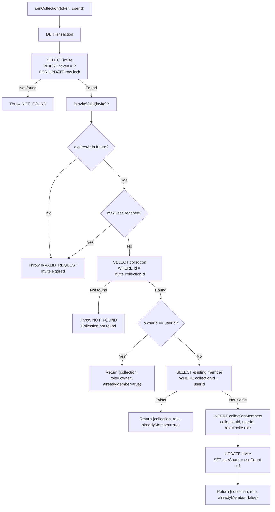

---

## 9. Marketplace Flow

### 9.1 List/Search Listings

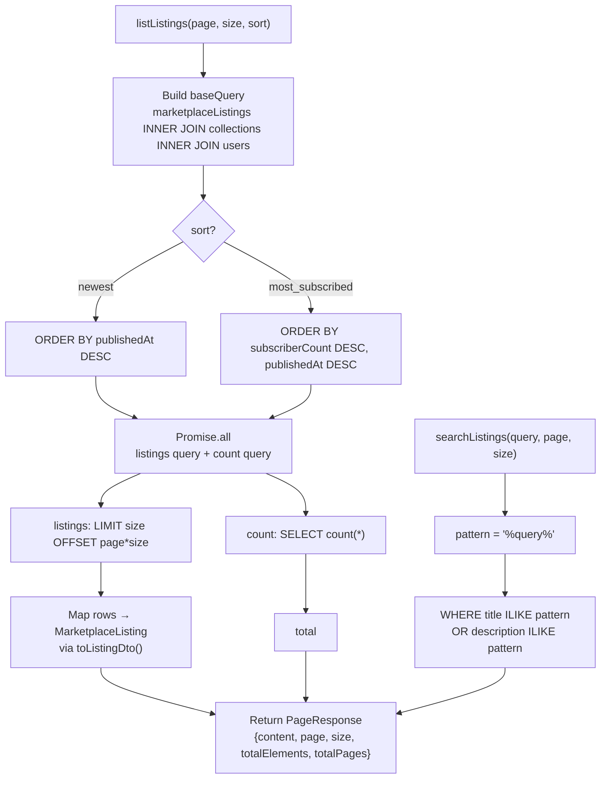

### 9.2 Publish to Marketplace

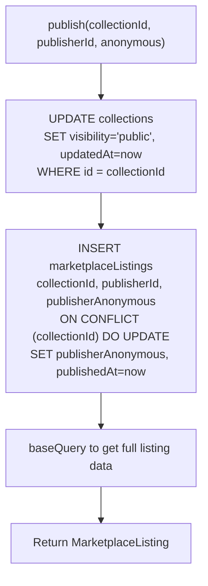

### 9.3 Subscribe

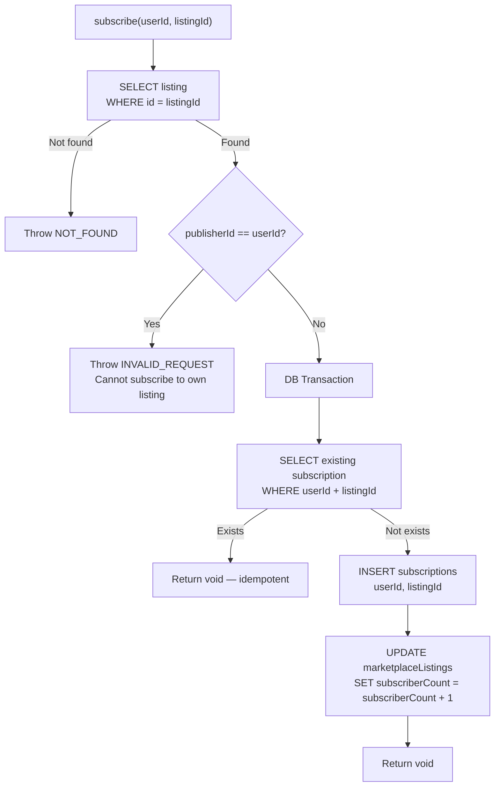

### 9.4 Fork

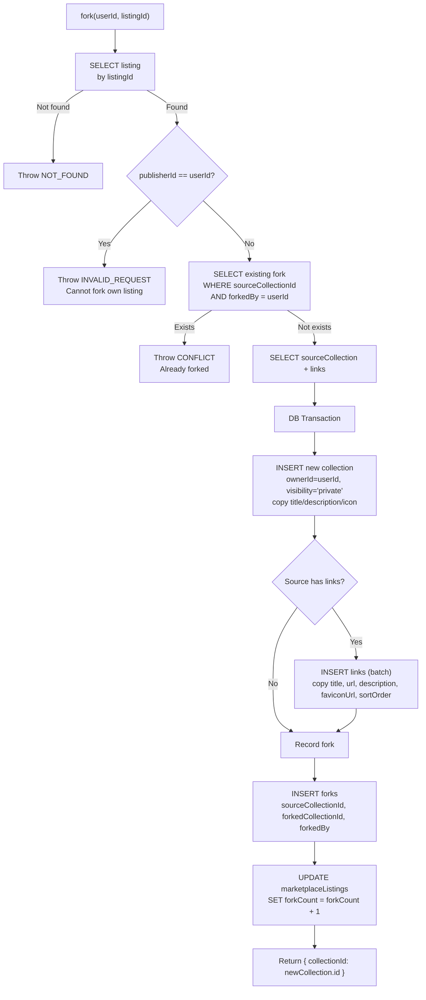

---

## 10. Family Todo Board

### 10.1 Kanban Board Data Assembly

```mermaid
flowchart TD
    A["getBoardData(spaceId, userId)"] --> B["spaceService.getById(spaceId)"]
    B -->|Not found| C["Throw NOT_FOUND<br/>Space not found"]
    B -->|Found| D["todoService.getListsForSpace(spaceId)<br/>ORDER BY sortOrder"]
    D --> E["todoService.getTodosForSpace(spaceId)<br/>INNER JOIN lists<br/>ORDER BY sortOrder"]
    E --> F[Collect all userIds<br/>from assignedTo, completedBy, createdBy]
    F --> G["fetchUsersById(userIds)<br/>Returns Map<id, user>"]
    G --> H["getSpaceAccess(userId, spaceId)<br/>Returns owner|admin|member|none"]
    H --> I[Group todos by listId]
    I --> J[For each list, build TodoListWithItems]
    J --> K[For each todo, build TodoResponse<br/>with UserBrief for creator/assignee/completer]
    K --> L["Return BoardResponse<br/>{ space, lists: ListWithItems[] }"]
```

### 10.2 Todo Operations

```mermaid
flowchart TD
    subgraph "Create List"
        CL1["createList(spaceId, title)"] --> CL2["SELECT max(sortOrder) FROM lists<br/>WHERE spaceId = ?"]
        CL2 --> CL3["INSERT list<br/>spaceId, title, sortOrder = max+1"]
        CL3 --> CL4[Return list]
    end

    subgraph "Create Todo"
        CT1["createTodo(listId, createdBy, data)"] --> CT2["SELECT max(sortOrder) FROM todos<br/>WHERE listId = ?"]
        CT2 --> CT3["INSERT todo<br/>listId, title, description, priority<br/>dueDate, assignedTo, createdBy<br/>sortOrder = max+1"]
        CT3 --> CT4[Return todo]
    end

    subgraph "Toggle Complete"
        TC1["toggleComplete(todoId, completed, userId)"] --> TC2{completed?}
        TC2 -->|Yes| TC3["SET completed=true, completedAt=now<br/>completedBy=userId, updatedAt=now"]
        TC2 -->|No| TC4["SET completed=false, completedAt=null<br/>completedBy=null, updatedAt=now"]
        TC3 --> TC5[Return updated todo]
        TC4 --> TC5
    end

    subgraph "Move Todo"
        MT1["moveTodo(todoId, targetListId)"] --> MT2[getTodoById]
        MT2 --> MT3[getListById - source]
        MT3 --> MT4[getListById - target]
        MT4 --> MT5{source.spaceId == target.spaceId?}
        MT5 -->|No| MT6["Throw INVALID_REQUEST<br/>Cannot cross spaces"]
        MT5 -->|Yes| MT7["SELECT max(sortOrder) FROM target list"]
        MT7 --> MT8["UPDATE todo<br/>SET listId=target, sortOrder=max+1"]
        MT8 --> MT9[Return updated todo]
    end

    subgraph "Reorder (Lists/Todos)"
        R1["reorderLists(spaceId, ids[])"]
        R2["reorderTodos(listId, ids[])"]
        R1 --> R3[DB Transaction]
        R2 --> R3
        R3 --> R4["Build CASE WHEN sql<br/>UPDATE SET sortOrder = CASE id<br/>WHEN id0 THEN 0<br/>WHEN id1 THEN 1<br/>..."]
    end
```

---

## 11. Monthly Bills

### 11.1 Access Control Layer

```mermaid
flowchart TD
    A["listAccessibleLists(userId)"] --> B[SELECT owned lists<br/>WHERE ownerId = userId<br/>LEFT JOIN familyTodoSpaces]
    A --> C[SELECT shared lists<br/>WHERE sharedSpaceId IS NOT NULL<br/>INNER JOIN spaceMembers<br/>WHERE member.userId = userId<br/>AND ownerId != userId]
    B --> D[Merge results]
    C --> D
    D --> E["Map access:<br/>owner → 'owner'<br/>space admin → 'admin'<br/>space member → 'member'"]
    E --> F[Sort: owners first, then by name]
    F --> G[Return MonthlyBillListResponse[]]

    H["getListAccess(userId, listId)"] --> I[SELECT list + sharedSpaceName<br/>LEFT JOIN familyTodoSpaces]
    I -->|Not found| J[Return null]
    I -->|Found| K{ownerId == userId?}
    K -->|Yes| L["Return access='owner'"]
    K -->|No| M{Has sharedSpaceId?}
    M -->|No| N["Return access='none'"]
    M -->|Yes| O["getSpaceAccess(userId, sharedSpaceId)"]
    O --> P["Map space role → bill access<br/>owner/admin → 'admin'<br/>member → 'member'<br/>none → 'none'"]
```

### 11.2 Get Board

```mermaid
flowchart TD
    A["getBoard(userId, input)"] --> B["listAccessibleLists(userId)"]
    B --> C{input.listId?}
    C -->|Yes| D[Find list by id in user's lists]
    D -->|Not found| E["Throw NOT_FOUND"]
    C -->|No| F["activeList = lists[0]"]
    D -->|Found| G[activeList = found]
    F --> H{activeList found?}
    G --> H
    H -->|No| I["Return empty board<br/>{period, lists, activeList: null, items: []}"]
    H -->|Yes| J["SELECT items + checks<br/>FROM monthlyBillItems<br/>LEFT JOIN monthlyBillChecks<br/>ON itemId AND periodYear AND periodMonth<br/>WHERE listId = activeList.id"]
    J --> K[Collect checkedBy userIds]
    K --> L[fetchUsersById for checkedBy]
    L --> M[Map rows to MonthlyBillItemResponse]
    M --> M1["For each item:<br/>- Compute dueDate = getDueDateForMonth(month, dueDay)<br/>- Compute status = getMonthlyBillStatus(dueDate, checkedAt)<br/>- Attach checkedBy UserBrief"]
    M1 --> N["Sort: by dueDate, then name"]
    N --> O["Return {period, lists, activeList, items}"]
```

### 11.3 Check/Uncheck Item

```mermaid
flowchart TD
    A["setItemChecked(userId, itemId, period, checked)"] --> B["getItemAccess(userId, itemId)"]
    B -->|Not found| C["Throw NOT_FOUND"]
    B -->|Found| D{checked?}
    D -->|Yes| E["UPSERT monthlyBillChecks<br/>INSERT ... ON CONFLICT<br/>(itemId, periodYear, periodMonth)<br/>DO UPDATE checkedAt, checkedBy"]
    D -->|No| F["DELETE FROM monthlyBillChecks<br/>WHERE itemId AND periodYear AND periodMonth"]
    E --> G[Return void]
    F --> G
```

---

## 12. Permission System

```mermaid
flowchart TD
    A["getCollectionAccess(userId, collectionId)"] --> B[SELECT collection<br/>WHERE id = collectionId]
    B -->|Not found| C["Return 'none'"]
    B -->|Found| D{userId != null AND<br/>ownerId == userId?}
    D -->|Yes| E["Return 'owner'"]
    D -->|No| F{userId != null?}
    F -->|Yes| G[SELECT collectionMembers<br/>WHERE collectionId + userId]
    G -->|Found - editor| H["Return 'edit'"]
    G -->|Found - viewer| I["Return 'view'"]
    G -->|Not found| J{visibility in ['public', 'unlisted']?}
    F -->|No (guest)| J
    J -->|Yes| I
    J -->|No| C

    K["requireAtLeast(actual, required)"] --> L{accessLevel[actual] >= accessLevel[required]?}
    L -->|No| M["Throw FORBIDDEN<br/>Insufficient access"]
    L -->|Yes| N[Continue]

    O["getSpaceAccess(userId, spaceId)"] --> P[SELECT space]
    P -->|Not found| Q["Return 'none'"]
    P -->|Found| R{ownerId == userId?}
    R -->|Yes| S["Return 'owner'"]
    R -->|No| T[SELECT spaceMember]
    T -->|Not found| Q
    T -->|Found - admin| U["Return 'admin'"]
    T -->|Found - member| V["Return 'member'"]
```

---

## 13. Client-Side Auth Flow (React Context)

```mermaid
flowchart TD
    A[<AuthProvider> mounts] --> B["useState: user=null, loading=true"]
    B --> C["useEffect → refresh()"]
    C --> D["api<SessionResponse>('/api/auth/session')<br/>GET request with credentials: 'include'"]
    D -->|Success| E[setUser(session.user)]
    E --> F[setLoading(false)]
    D -->|Error| G[setUser(null)]
    G --> F

    subgraph "User Actions"
        H["login(email, password)"] --> I["api<SessionResponse>('/api/auth/login', POST)<br/>body: {email, password}"]
        I --> J[setUser(session.user)]
        I -->|Error| K[api-client throws + auto-toast]

        L["register(email, password, displayName?)"] --> M["api<SessionResponse>('/api/auth/register', POST)<br/>body: {email, password, displayName}"]
        M --> J

        N["logout()"] --> O["api('/api/auth/logout', POST)"]
        O --> P[setUser(null)]
    end
```

---

## 14. Client-Side API Client

```mermaid
flowchart TD
    A["api<T>(path, options)"] --> B{body defined?}
    B -->|Yes| C["Set Content-Type: application/json"]
    B -->|No| D[Skip]
    C --> E["fetch(path, { credentials: 'include', body: JSON.stringify(body) })"]
    D --> E
    E --> F{res.status == 204?}
    F -->|Yes| G[Return undefined]
    F -->|No| H[const data = await res.json()]
    H --> I{res.ok?}
    I -->|No| J["pushToast(message, 'error')"]
    J --> K["throw Error with { code, status }"]
    I -->|Yes| L[Return data as T]
```

---

## 15. Tool Functions

### 15.1 Mortgage Calculator — Mode A

```mermaid
flowchart TD
    A["calculateMortgageModeA(input)"] --> B["monthlyRate = annualRate / 100 / 12"]
    B --> C["periods = tenureYears * 12"]
    C --> D["loanAmount = propertyPrice - downPayment"]
    D --> E["computeMonthlyPayment(loanAmount, monthlyRate, periods)"]
    E --> F{monthlyRate == 0?}
    F -->|Yes| G["payment = loanAmount / periods"]
    F -->|No| H["factor = (1+rate)^periods<br/>payment = loanAmount * rate * factor / (factor-1)"]
    G --> I["monthlyPayment = round2(result)"]
    H --> I
    I --> J["totalPayment = monthlyPayment * periods"]
    J --> K["totalInterest = totalPayment - loanAmount"]
    K --> L["Return {loanAmount, monthlyPayment, totalInterest, totalPayment}"]
```

### 15.2 Mortgage Calculator — Mode B

```mermaid
flowchart TD
    A["calculateMortgageModeB(input)"] --> B["monthlyRate = annualRate / 100 / 12"]
    B --> C["periods = tenureYears * 12"]
    C --> D["Compute maxAffordableLoan<br/>from targetMonthlyPayment"]
    D --> E{maxAffordableLoan >= propertyPrice?}
    E -->|Yes| F["fullCoverage = true<br/>loanAmount = propertyPrice<br/>downPayment = 0"]
    E -->|No| G["fullCoverage = false<br/>loanAmount = maxAffordableLoan<br/>downPayment = propertyPrice - maxAffordableLoan"]
    F --> H["monthlyPayment = computeMonthlyPayment()<br/>totalPayment, totalInterest"]
    G --> H
    H --> I{maxLtvPercent set?}
    I -->|Yes| J["exceedsLtv = loanAmount > propertyPrice * maxLtvPercent / 100"]
    I -->|No| K[Skip LTV check]
    J --> L["Return full result with LTV info"]
    K --> L
```

### 15.3 Resignation Last Day Calculator

```mermaid
flowchart TD
    A["calculateLastDay(input)"] --> B["base = new Date(resignationDate)"]
    B --> C{mode?}
    C -->|days| D["noticeEndDate = base + input.value days"]
    C -->|months| E["rawMonth = base.month + input.value<br/>Adjust year/month with carryover"]
    E --> F["Clamp day to last day of target month<br/>Math.min(targetDay, lastDayOfTargetMonth)"]
    F --> G["noticeEndDate = new Date(year, month, clampedDay)"]
    D --> H["lastWorkingDay = noticeEndDate - 1 day"]
    G --> H
    H --> I["Return {lastWorkingDay, noticeEndDate}"]
```

### 15.4 Cheque Amount Converter

```mermaid
flowchart TD
    A["validateChequeAmount(raw)"] --> B{isEmpty or NaN?}
    B -->|Yes| C["Return error: 'invalidAmount'"]
    B -->|No| D{Decimals > 2?}
    D -->|Yes| E["Return error: 'tooManyDecimals'"]
    D -->|No| F{Amount > 99,999,999.99?}
    F -->|Yes| G["Return error: 'amountTooLarge'"]
    F -->|No| H[Return null — valid]

    I["convertToChequeAmount(amount)"] --> J["rounded = Math.round(amount * 100)<br/>yuanInt = floor(rounded/100)<br/>cents = rounded % 100<br/>jiao = floor(cents/10), fen = cents % 10"]
    J --> K["Chinese: convertIntegerChinese(yuanInt)"]
    J --> L["English: convertEnglish(yuanInt, cents)"]
    K --> M[Format: intChinese + '圓' + decChinese + '正/整']
    L --> N[Format: 'Dollars' + cents in English + 'Only']
    M --> O[Return {chinese, english}]
    N --> O
```

### 15.5 Monthly Bill Utilities

```mermaid
flowchart TD
    subgraph "Month Key Operations"
        M1["getCurrentMonthKey(date)"] --> M2["Return 'YYYY-MM'"]
        M3["isValidMonthKey(month)"] --> M4["Test regex: ^\\d{4}-(0[1-9]|1[0-2])$"]
        M5["getRelativeMonthKey(month, offset)"] --> M6["Validate monthKey"]
        M6 --> M7["Parse year, month, add offset<br/>Return getCurrentMonthKey(newDate)"]
        M8["getDaysInMonth(month)"] --> M9["new Date(year, month, 0).getDate()"]
        M10["getDueDateForMonth(month, dueDay)"] --> M11["Clamp dueDay to daysInMonth"]
        M11 --> M12["Return 'YYYY-MM-DD'"]
    end

    subgraph "Amount Parsing"
        A1["parseAmountToCents(input)"] --> A2["Trim + remove commas"]
        A2 --> A3{Matches \\d+(\\.\\d{1,2})?}
        A3 -->|No| A4[Return null]
        A3 -->|Yes| A5["dollars * 100 + cents"]
        A5 --> A6[Return cents integer]
    end

    subgraph "Status Calculation"
        S1["getMonthlyBillStatus(dueDate, checkedAt, today)"] --> S2{checkedAt exists?}
        S2 -->|Yes| S3["Return 'paid'"]
        S2 -->|No| S4{dueDate < todayKey?}
        S4 -->|Yes| S5["Return 'overdue'"]
        S4 -->|No| S6{dueDate == todayKey?}
        S6 -->|Yes| S7["Return 'dueToday'"]
        S6 -->|No| S8["Return 'upcoming'"]
    end

    subgraph "Build Entries"
        B1["buildMonthlyBillEntries(templates, checks, month, today)"] --> B2[For each template]
        B2 --> B3["Compute dueDate = getDueDateForMonth(month, dueDay)"]
        B3 --> B4["Get checkedAt from checks[templateId][month]"]
        B4 --> B5["Compute status = getMonthlyBillStatus(dueDate, checkedAt)"]
        B5 --> B6["Build entry with all fields"]
        B6 --> B7["Sort by dueDate, then name"]
        B7 --> B8[Return MonthlyBillEntry[]]
    end

    subgraph "Summary Calculation"
        C1["calculateMonthlyBillSummary(entries)"] --> C2["Reduce over entries"]
        C2 --> C3["Count total, paid, unpaid<br/>Sum amounts<br/>Count overdue, dueToday"]
        C3 --> C4["Return MonthlyBillSummary"]
    end
```

---

## 16. Error Handling System

```mermaid
flowchart TD
    A["AppError thrown<br/>new AppError(code, message)"] --> B[Caught by withAuth/withOptionalAuth wrapper]
    B --> C["apiError(code, message)"]
    C --> D[Map ErrorCode to HTTP status]
    D --> E{code?}
    E -->|NOT_FOUND| F[404]
    E -->|FORBIDDEN| G[403]
    E -->|UNAUTHORIZED| H[401]
    E -->|INVALID_CREDENTIALS| I[401]
    E -->|INVALID_REQUEST| J[400]
    E -->|CONFLICT| K[409]
    E -->|INTERNAL_ERROR| L[500]
    F & G & H & I & J & K & L --> M["Response.json({code, message}, {status})"]

    N[Uncaught errors] --> O[Next.js error boundary]
    O --> P[500 Internal Server Error]

    subgraph "Client Side"
        Q["api-client.ts"] --> R{res.ok?}
        R -->|No| S[data = await res.json()]
        S --> T["pushToast(message, 'error')"]
        T --> U["throw Error with {code, status}"]
    end
```

---

## 17. CSRF Origin Validation

```mermaid
flowchart TD
    A["validateOrigin(req)"] --> B{Method in GET/HEAD/OPTIONS?}
    B -->|Yes| C[Return true — safe methods]
    B -->|No| D{APP_BASE_URL env set?}
    D -->|No| E{production?}
    E -->|Yes| F[Return false]
    E -->|No| G[Return true — dev mode]
    D -->|Yes| H["allowedHost = new URL(APP_BASE_URL).host"]
    H --> I{Origin header present?}
    I -->|Yes| J[Parse Origin URL]
    J -->|Invalid URL| K[Return false]
    J -->|Valid| L{Origin host == allowedHost?}
    L -->|Yes| C
    L -->|No| K
    I -->|No| M{Referer header present?}
    M -->|Yes| N[Parse Referer URL]
    N -->|Invalid URL| K
    N -->|Valid| O{Referer host == allowedHost?}
    O -->|Yes| C
    O -->|No| K
    M -->|No| K
```

---

## 18. IP Extraction (Trusted Proxy)

```mermaid
flowchart TD
    A["getClientIp(req)"] --> B["directIp = x-real-ip header or '127.0.0.1'"]
    B --> C{TRUSTED_PROXIES.has(directIp)?}
    C -->|No| D[Return directIp]
    C -->|Yes| E["x-forwarded-for header present?"]
    E -->|No| D
    E -->|Yes| F["Parse first IP from x-forwarded-for<br/>split(',')[0].trim()"]
    F --> G{Valid non-empty?}
    G -->|Yes| H[Return first forwarded IP]
    G -->|No| D
```

---

## 19. Theme Management (Client)

```mermaid
flowchart TD
    A["useTheme()"] --> B["useSyncExternalStore<br/>subscribe: storage event<br/>getSnapshot: read data-theme from html"]
    B --> C{Current theme?}
    C -->|null| D["setTheme(DEFAULT_THEME)"]
    C -->|value| E[Return theme + setTheme]
    D --> E

    F["setTheme(theme)"] --> G["document.documentElement.setAttribute('data-theme', theme)"]
    G --> H["localStorage.setItem('theme', theme)"]
    H --> I["window.dispatchEvent(StorageEvent) — notify subscribers"]
```

---

## 20. Toast Notification System

```mermaid
flowchart TD
    A["pushToast(message, type)"] --> B["Dispatch CustomEvent('push-toast')<br/>detail: {id, message, type}"]
    B --> C["<ToastHost> listener receives event"]
    C --> D["Add toast to state array"]
    D --> E[Render toast with slide-in animation]
    E --> F["Set auto-dismiss setTimeout (3s)"]
    F --> G[Remove with slide-out animation when dismissed]

    H["api-client error"] --> I["pushToast(errorMessage, 'error')"]
    I --> A
```

---

## 21. SSR Data Fetching Pattern

```mermaid
flowchart TD
    A[Page Request] --> B[Next.js App Router]
    B --> C[Async Server Component]
    C --> D["getServerUser()<br/>Read cookie, validate session"]
    D -->|No user| E[Render public view or redirect]
    D -->|Has user| F[Call service functions directly<br/>e.g., listForUser(user.id)]
    F --> G[Await DB queries]
    G --> H[Pass data as props to Client Component]
    H --> I["<ClientComponent initialData={data} />"]
    I --> J["Client Component renders<br/>useState with initialData"]
    J --> K[Mutations via api-client → API Routes]
```

---

## 22. Database Layer — Drizzle ORM

```mermaid
flowchart TD
    A["db (Drizzle ORM instance)"] --> B["postgres.js connection pool<br/>max 20 connections<br/>idle timeout 30s"]
    B --> C[PostgreSQL Database]

    subgraph "Schema Modules"
        D1[users.ts] --> D2["Table: users<br/>id, email, displayName, avatarUrl, role, timestamps"]
        E1[auth.ts] --> E2["Table: authIdentities<br/>userId, provider, passwordHash, email"]
        E1 --> E3["Table: authSessions<br/>userId, tokenHash, expiresAt, lastSeenAt"]
        F1[collections.ts] --> F2["Table: collections<br/>ownerId, title, description, icon, visibility, sortOrder"]
        F1 --> F3["Table: links<br/>collectionId, title, url, description, faviconUrl, sortOrder"]
        G1[collaboration.ts] --> G2["Table: collectionMembers<br/>collectionId, userId, role"]
        G1 --> G3["Table: collectionInviteLinks<br/>collectionId, token, role, maxUses, useCount, expiresAt"]
        H1[marketplace.ts] --> H2["Table: marketplaceListings<br/>collectionId (unique), publisherId, subscriberCount, forkCount"]
        H1 --> H3["Table: subscriptions", "Table: forks"]
        I1[familyTodo.ts] --> I2["Tables: spaces, spaceMembers, lists, todos, inviteLinks"]
        J1[monthlyBills.ts] --> J2["Tables: billLists, billItems, billChecks"]
        K1[rateLimit.ts] --> K2["Tables: rateLimitEntries, loginFailures"]
    end
```

---

## Function Index

| # | File | Functions |
|---|------|-----------|
| 1 | `middleware.ts` | `middleware` |
| 2 | `server/api-helpers.ts` | `rateLimit`, `rateLimitCheck`, `getRateLimitConfig`, `applyRateLimit`, `isAccountLocked`, `trackLoginFailure`, `clearLoginFailures`, `getClientIp`, `validateOrigin`, `withAuth`, `withOptionalAuth`, `withAdmin` |
| 3 | `server/auth.ts` | `getServerUser`, `resolveSession`, `setSessionCookie`, `clearSessionCookie` |
| 4 | `server/services/auth-service.ts` | `hashPassword`, `verifyPassword`, `register`, `login` |
| 5 | `server/services/session-service.ts` | `hashSessionToken`, `createSession`, `validateSession`, `destroySession` |
| 6 | `server/services/user-service.ts` | `createUser`, `findByEmail`, `findById`, `fetchUsersById` |
| 7 | `server/services/collection-service.ts` | `listForUser`, `getById`, `create`, `update`, `updateVisibility`, `remove` |
| 8 | `server/services/link-service.ts` | `isPrivateIP`, `validateUrl`, `listForCollection`, `create`, `update`, `remove`, `reorder` |
| 9 | `server/services/member-service.ts` | `listForCollection`, `updateRole`, `remove` |
| 10 | `server/services/invite-service.ts` | `generateToken`, `listForCollection`, `create`, `remove`, `getByToken`, `isInviteValid`, `joinCollection` |
| 11 | `server/services/permission-service.ts` | `getCollectionAccess`, `getSpaceAccess`, `requireAtLeast`, `requireSpaceAtLeast` |
| 12 | `server/services/marketplace-service.ts` | `maskPublisher`, `toListingDto`, `baseQuery`, `baseCountQuery`, `listListings`, `searchListings`, `getDetail`, `publish`, `unpublish` |
| 13 | `server/services/subscription-service.ts` | `subscribe`, `unsubscribe`, `listUserSubscriptions`, `isSubscribed`, `fork` |
| 14 | `server/services/family-todo-space-service.ts` | `generateToken`, `listForUser`, `getById`, `create`, `update`, `remove`, `listMembers`, `removeMember`, `createInvite`, `listInvites`, `deleteInvite`, `getInviteByToken`, `isInviteValid`, `joinSpace` |
| 15 | `server/services/family-todo-service.ts` | `createList`, `updateList`, `removeList`, `reorderLists`, `createTodo`, `updateTodo`, `removeTodo`, `toggleComplete`, `moveTodo`, `reorderTodos`, `getTodoById`, `getListById`, `getSpaceIdForList`, `getSpaceIdForTodo`, `getListsForSpace`, `getTodosForSpace` |
| 16 | `server/services/family-todo-board-service.ts` | `toUserBrief`, `toTodoResponse`, `buildTodoResponse`, `getBoardData` |
| 17 | `server/services/monthly-bill-service.ts` | `toUserBrief`, `accessFromSpaceRole`, `toListResponse`, `assertCanView`, `assertCanManageItems`, `assertCanManageList`, `validateDueDay`, `monthKey`, `validateShareTarget`, `listAccessibleLists`, `getListAccess`, `getItemAccess`, `createList`, `updateList`, `removeList`, `createItem`, `updateItem`, `removeItem`, `setItemChecked`, `getBoard` |
| 18 | `lib/errors.ts` | `apiError`, `AppError` |
| 19 | `lib/api-client.ts` | `api<T>` |
| 20 | `lib/auth.tsx` | `AuthProvider`, `useAuth` |
| 21 | `lib/toast.ts` | `pushToast` |
| 22 | `lib/theme.ts` | `setTheme`, `useTheme` |
| 23 | `lib/tools/mortgage.ts` | `computeMonthlyPayment`, `round2`, `calculateMortgageModeA`, `calculateMortgageModeB` |
| 24 | `lib/tools/resignation.ts` | `calculateLastDay` |
| 25 | `lib/tools/cheque-amount.ts` | `validateChequeAmount`, `formatHKD`, `convertIntegerChinese`, `convertDecimalChinese`, `convertToChequeAmount`, `convertHundreds`, `convertIntegerEnglish`, `convertEnglish` |
| 26 | `lib/tools/monthly-bills.ts` | `formatDateKey`, `getCurrentMonthKey`, `isValidMonthKey`, `getRelativeMonthKey`, `getDaysInMonth`, `getDueDateForMonth`, `parseAmountToCents`, `formatHKD`, `getMonthlyBillStatus`, `buildMonthlyBillEntries`, `setMonthlyBillChecked`, `calculateMonthlyBillSummary` |
| 27 | `schemas/parse-body.ts` | `parseBody` |
| 28 | `hooks/useCollectionAccess.ts` | `useCollectionAccess` |
| 29 | `components/providers.tsx` | `Providers` |
| 30 | `components/ToastHost.tsx` | `ToastHost` |

**Total: ~130 functions across 30 source files**
